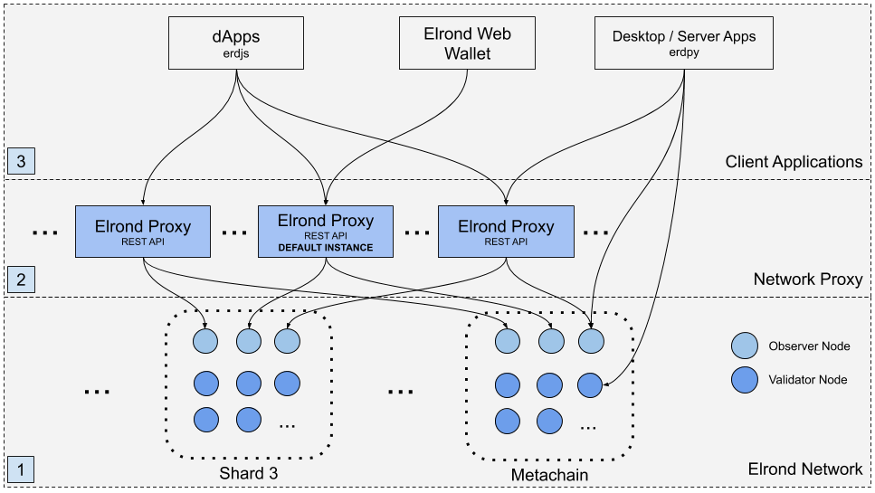

# elrond-proxy

The **Elrond Proxy** acts as an entry point into the Elrond Network. 

For more details, go to [docs.elrond.com](https://docs.elrond.com/tools/proxy).

## Rest API endpoints

### address

- `/address/:address`         (GET) --> returns the account's data in JSON format for the given :address.
- `/address/:address/balance` (GET) --> returns the balance of a given :address.
- `/address/:address/nonce`   (GET) --> returns the nonce of an :address.
- `/address/:address/storage/:key`   (GET) --> returns the value for a given key for an account.
- `/address/:address/transactions` (GET) --> returns the transactions stored in indexer for a given :address.

### transaction

- `/transaction/send`         (POST) --> receives a single transaction in JSON format and forwards it to an observer in the same shard as the sender's shard ID. Returns the transaction's hash if successful or the interceptor error otherwise.
- `/transaction/send-multiple` (POST) --> receives a bulk of transactions in JSON format and will forward them to observers in the rights shards. Will return the number of transactions which were accepted by the interceptor and forwarded on the p2p topic.
- `/transaction/send-user-funds` (POST) --> receives a request containing `address`, `numOfTxs` and `value` and will select a random account from the PEM file in the same shard as the address received. Will return the transaction's hash if successful or the interceptor error otherwise.
- `/transaction/cost`         (POST) --> receives a single transaction in JSON format and returns it's cost
- `/transaction/:txHash` (GET) --> returns the transaction which corresponds to the hash
- `/transaction/:txHash?sender=senderAddress` (GET) --> returns the transaction which corresponds to the hash (faster because will ask for transaction from observer which is in the shard in which the address is part)
- `/transaction/:txHash/status` (GET) --> returns the status of the transaction which corresponds to the hash
- `/transaction/:txHash/status?sender=senderAddress` (GET) --> returns the status of the transaction which corresponds to the hash (faster because will ask for transaction status from observer which is in the shard in which the address is part)

### vm-values

- `/vm-values/hex`            (POST) --> receives a VM Request (`scAddress` string, `funcName` string and `args` []string) and returns the result of the VM Query in hex encoded string format
- `/vm-values/string`         (POST) --> receives a VM Request (`scAddress` string, `funcName` string and `args` []string) and returns the result of the VM Query in string format
- `/vm-values/int`            (POST) --> receives a VM Request (`scAddress` string, `funcName` string and `args` []string) and returns the result of the VM Query in integer format
- `/vm-values/query`          (POST) --> receives a VM Request (`scAddress` string, `funcName` string and `args` []string) and returns the result of the VM Query

### network

- `/network/status/:shard`    (GET) --> returns the status metrics from an observer in the given shard
- `/network/config`           (GET) --> returns the configuration of the network from any observer

### node

- `/node/heartbeatstatus`     (GET) --> returns the heartbeat data from an observer from any shard. Has a cache to avoid many requests

### validator

- `/validator/statistics`     (GET) --> returns the validator statistics data from an observer from any shard. Has a cache to avoid many requests

### block

- `/block/:shardID/by-nonce/:nonce`    (GET) --> returns a block by nonce
- `/block/:shardID/by-nonce/:nonce?withTxs=true`    (GET) --> returns a block by nonce, with transactions included
- `/block/:shardID/by-hash/:hash`    (GET) --> returns a block by hash
- `/block/:shardID/by-hash/:hash?withTxs=true`    (GET) --> returns a block by hash, with transactions included

### block-atlas

- `block-atlas/:shard/:nonce`   (GET) --> returns a block by nonce, as required by Block Atlas

### hyperblock

- `hyperblock/by-nonce/:nonce`  (GET) --> returns a hyperblock by nonce, with transactions included
- `hyperblock/by-hash/:hash`    (GET) --> returns a hyperblock by hash, with transactions included